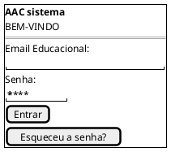
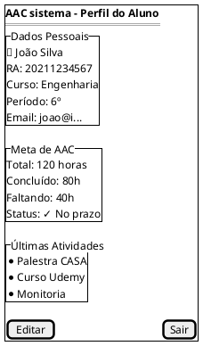
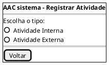
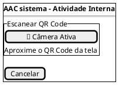
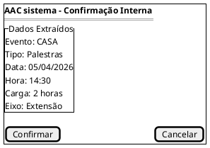
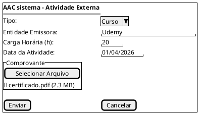
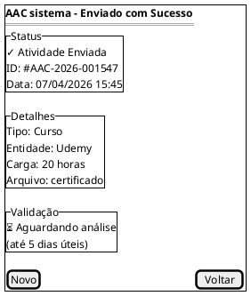
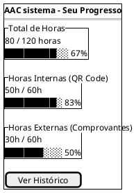

## Introdução

O protótipo de baixa fidelidade auxilia a equipe a visualizar o fluxo básico da aplicação AAC sistema. Este protótipo apresenta as 8 principais telas do sistema com autenticação, perfil e os fluxos distintos para atividades internas e externas.

## Metodologia

Após análise do Brainstorm e AHT, foram identificadas as 8 telas principais do sistema. O protótipo foi desenvolvido com PlantUML Salt para manter clareza e simplicidade na comunicação entre membros da equipe.

## Protótipo de Baixa Fidelidade - Versão 1.0

### Tela 1: Login

### Tela 2: Perfil do Aluno

### Tela 3: Seleção de Tipo de Atividade

### Tela 4: Fluxo Interno - Escanear QR Code

### Tela 5: Fluxo Interno - Confirmação

### Tela 6: Fluxo Externo - Upload Comprovante

### Tela 7: Fluxo Externo - Comprovante de Envio

### Tela 8: Dashboard de Horas

Na primeira versão do protótipo utilizamos a ferramenta <a href="https://m2.material.io/design/color/the-color-system.html#color-theme-creation">Material Design Color Tool</a> para auxiliar na criação da paleta de cores do aplicativo. Definimos as cores base, mas as cores definidas para algumas telas específicas ainda não foram decididas.

## Versão 2.0

## Conclusão

A partir da elaboração do protótipo foi possível ter uma noção inicial da interface do usuário, definindo fluxo, paleta de cores, botões, app bars e diversas outras funcionalidades.

## Referências

> Material Design Color Tool. Disponível em: https://m2.material.io/design/color/the-color-system.html#color-theme-creation

> PMI. Um guia do conhecimento em gerenciamento de projetos. Guia PMBOK® 5a. ed. EUA: Project Management Institute, 2013.

> Figma. Disponível em: https://www.figma.com

## Autor(es)

| Data     | Versão | Descrição                            | Autor(es)                                                                            |
| -------- | ------- | -------------------------------------- | ------------------------------------------------------------------------------------ |
| 07/04/26 | 1.0     | Criação do documento                 | Gabriel Caruzo                                                                       |
